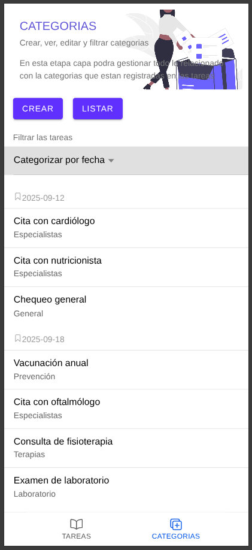
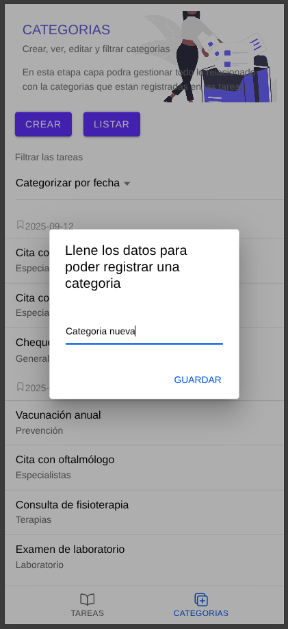

# Proyecto Ionic - App de Tareas y Categorías

Este proyecto es una aplicación desarrollada con **Ionic + React + TypeScript**, que permite gestionar tareas y categorías de manera sencilla. Incluye pruebas con **Cypress**, y está preparada para ser compilada en **Android (APK)** e **iOS (IPA)** usando Capacitor.

---

## Estructura del Proyecto
```
.
├── capacitor.config.ts
├── cypress
│   ├── e2e
│   │   └── test.cy.ts
│   ├── fixtures
│   │   └── example.json
│   └── support
│       ├── commands.ts
│       └── e2e.ts
├── cypress.config.ts
├── eslint.config.js
├── index.html
├── ionic.config.json
├── package.json
├── package-lock.json
├── public
│   ├── favicon.png
│   └── manifest.json
├── README.md
├── src
│   ├── App.test.tsx
│   ├── App.tsx
│   ├── assets
│   │   └── img
│   │       └── image.png
│   ├── components
│   │   ├── ExploreContainer.css
│   │   └── ExploreContainer.tsx
│   ├── main.tsx
│   ├── pages
│   │   ├── categorias
│   │   │   ├── Categoria.css
│   │   │   ├── Categoria.tsx
│   │   │   ├── components
│   │   │   │   ├── AddCategoria.tsx
│   │   │   │   ├── CardTitle.tsx
│   │   │   │   └── ListCategoria.tsx
│   │   │   ├── img
│   │   │   │   └── undraw_collecting_3zyb.png
│   │   │   └── interfaces
│   │   │       └── ICategoria.tsx
│   │   └── tareas
│   │       ├── components
│   │       │   ├── AddTarea.tsx
│   │       │   ├── CardTarea.tsx
│   │       │   ├── CardTitle.tsx
│   │       │   ├── ContentTarea.tsx
│   │       │   └── Grid.tsx
│   │       ├── img
│   │       │   └── imgcard.png
│   │       ├── interfaces
│   │       │   └── ITareas.tsx
│   │       ├── Tareas.css
│   │       └── Tareas.tsx
│   ├── setupTests.ts
│   ├── utils
│   │   └── Constants.ts
│   └── vite-env.d.ts
├── tsconfig.json
├── tsconfig.node.json
└── vite.config.ts
```

---

## Requisitos

- Node.js >= 18
- npm >= 9
- Ionic CLI
- Capacitor para compilación nativas

---

## Instalación y Ejecución
```bash
# Clonar repositorio
git clone <URL_DEL_REPOSITORIO>
cd <NOMBRE_DEL_PROYECTO>

# Instalar dependencias
npm install

# Levantar aplicación en modo desarrollo
ionic serve --host=0.0.0.0
```

## Cambios Implementados

* Funcionalidades para gestionar tareas y categorías.
* Componentes reutilizables (CardTarea, AddTarea, ListCategoria).
* Optimización de la carga de imágenes y componentes mediante lazy loading.
* Estructura modular para mejorar la mantenibilidad.
---

# Desafíos y Soluciones

## Desafíos principales:

- Manejo del estado global de tareas y categorías.
- Coordinación entre componentes de UI para actualizaciones dinámicas.

## Optimización de rendimiento:

- Lazy loading de imágenes y componentes pesados.
- Calidad y mantenibilidad:
- Separación clara de componentes, páginas y utilidades.

## Vista sobre la gestión de tareas


## Registro de una nueva tarea


## Completación de una tarea


## Eliminación de una tarea


## Gestion de categorias


## Registrar una nueva categoria


## Listado de categorias


## Listado y edición de categorias


## Filtrar categorias


## Principales desafíos:
Como mi experiencia principal no es en desarrollo móvil, algunos desafíos fueron el manejo de herramientas específicas como Firebase y feature flags, y la generación de APKs. Aunque no implementé estas funcionalidades, investigué cómo funcionan y entendí los pasos necesarios, lo que me permitió familiarizarme con el ecosistema móvil y preparar el terreno para futuras implementaciones.”

## Técnicas de optimización de rendimiento:
No llegué a aplicar técnicas avanzadas de optimización, pero durante el desarrollo mantuve buenas prácticas de código, como modularización de componentes y separación de lógica de interfaz, para que la aplicación sea más mantenible y eficiente.

## Calidad y mantenibilidad del código:
Me enfoqué en mantener una estructura clara y modular, documentar funciones importantes y seguir convenciones de código consistentes. Aunque no implementé pruebas automatizadas, estas prácticas ayudan a que el proyecto sea más fácil de mantener y escalar.